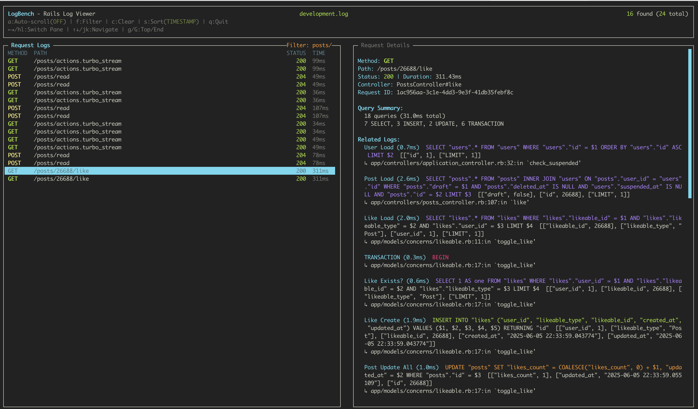

# LogBench

A powerful TUI (Terminal User Interface) for analyzing Rails application logs in real-time. LogBench provides an intuitive interface to view HTTP requests, SQL queries, and performance metrics from your Rails logs.



## Features

- 🚀 **Real-time log analysis** with auto-scroll
- 📊 **Request correlation** - groups SQL queries with HTTP requests
- 🔍 **Advanced filtering** by method, path, status, controller, and more
- 📈 **Performance insights** - duration, allocations, query analysis
- 🎨 **Beautiful TUI** with syntax highlighting and ANSI color support
- ⚡ **Fast parsing** of JSON-formatted logs

## Installation

Add LogBench to your Rails application's Gemfile:

```ruby
# Gemfile
group :development do
  gem 'log_bench'
end
```

Then run:

```bash
bundle install
```

## Configuration

### 1. Configure Rails Logging

Add this configuration to your `config/environments/development.rb`:

```ruby
# config/environments/development.rb
require "lograge"

Rails.application.configure do
  # ... other configuration ...

  # LogBench: Configure structured logging
  config.lograge.enabled = true
  config.lograge.formatter = Lograge::Formatters::Json.new
  config.logger ||= ActiveSupport::Logger.new(config.default_log_file)
  config.logger.formatter = LogBench::JsonFormatter.new
end
```

### 2. Set Up Request ID Tracking

Create or update your `Current` model to track request IDs:

```ruby
# app/models/current.rb
# frozen_string_literal: true

class Current < ActiveSupport::CurrentAttributes
  attribute :request_id
end
```

Add request ID tracking to your ApplicationController:

```ruby
# app/controllers/application_controller.rb
class ApplicationController < ActionController::Base
  before_action :set_current_request_identifier

  protected

  def set_current_request_identifier
    Current.request_id = request.request_id
  end
end
```

### 3. Restart Your Rails Server

After configuration, restart your Rails development server:

## Usage

### Basic Usage

View your development logs:

```bash
log_bench
# or explicitly for a specific log file
log_bench log/development.log
```

### TUI Controls

- **Navigation**: `↑↓` or `jk` to navigate requests
- **Pane switching**: `←→` or `hl` to switch between request list and details
- **Filtering**: `f` to open filter dialog
- **Clear filter**: `c` to clear an active filter (press `escape` or `enter` before pressing `c` to clear)
- **Sorting**: `s` to cycle through sort options (timestamp, duration, status)
- **Auto-scroll**: `a` to toggle auto-scroll mode
- **Quit**: `q` to exit

### Filtering

Press `f` to open the filter dialog. 

In the left pane you can filter by:

- **Method**: GET, POST, PUT, DELETE, etc.
- **Path**: URL path patterns
- **Status**: HTTP status codes (200, 404, 500, etc.)
- **Controller**: Controller name
- **Action**: Action name
- **Request ID**: Unique request identifier

Examples:
- Filter by method: `GET`
- Filter by path: `/api/users`
- Filter by status: `500`
- Filter by controller: `UsersController`
- Filter by action: `create`
- Filter by request ID: `abcdef-b1n2mk ...`

In the right pane you can filter related log lines by text content to find specific SQL queries or anything else
you want to find in the logs.


## Log Format

LogBench works with JSON-formatted logs. Each log entry should include:

**Required fields for HTTP requests:**
- `method`: HTTP method (GET, POST, etc.)
- `path`: Request path
- `status`: HTTP status code
- `request_id`: Unique request identifier
- `duration`: Request duration in milliseconds

**Optional fields:**
- `controller`: Controller name
- `action`: Action name
- `allocations`: Memory allocations
- `view`: View rendering time
- `db`: Database query time

**Other query logs:**
- `message`: SQL query with timing information
- `request_id`: Links query to HTTP request

## Testing

LogBench includes a comprehensive test suite to ensure reliability and correctness.

### Running Tests

```bash
# Run all tests
bundle exec rake test

# Run specific test files
bundle exec ruby test/test_log_entry.rb
bundle exec ruby test/test_request.rb
bundle exec ruby test/test_json_formatter.rb

# Run tests with verbose output
bundle exec rake test TESTOPTS="-v"
```

### Test Coverage

The test suite covers:

- **Log parsing**: JSON format detection and parsing
- **Request correlation**: Grouping SQL queries with HTTP requests
- **Filtering**: Method, path, status, and duration filters
- **JsonFormatter**: Custom logging format handling
- **TUI components**: Screen rendering and user interactions
- **Edge cases**: Malformed logs, missing fields, performance scenarios

### Writing Tests

When contributing, please include tests for new features:

```ruby
# test/test_new_feature.rb
require "test_helper"

class TestNewFeature < Minitest::Test
  def test_feature_works
    # Your test code here
    assert_equal expected, actual
  end
end
```

## Troubleshooting

### No requests found

1. **Check log file exists**: Ensure the log file path is correct
2. **Verify lograge configuration**: Make sure lograge is enabled and configured
3. **Check log format**: LogBench requires JSON-formatted logs
4. **Generate some requests**: Make HTTP requests to your Rails app to generate logs

### SQL queries not showing

1. **Check request_id correlation**: Ensure SQL queries and HTTP requests share the same `request_id`
2. **Verify Current model**: Make sure `Current.request_id` is being set properly
3. **Check JsonFormatter**: Ensure the JsonFormatter is configured for your Rails logger

### Performance issues

1. **Large log files**: LogBench loads the entire log file into memory. For very large files, consider rotating logs more frequently
2. **Real-time parsing**: Use auto-scroll mode (`a`) for better performance with actively growing log files

## Contributing

1. Fork the repository
2. Create your feature branch (`git checkout -b feature/amazing-feature`)
3. Commit your changes (`git commit -m 'Add amazing feature'`)
4. Push to the branch (`git push origin feature/amazing-feature`)
5. Open a Pull Request

## License

This gem is available as open source under the terms of the [MIT License](LICENSE).

## Support

- 🐛 **Bug reports**: [GitHub Issues](https://github.com/silva96/log_bench/issues)
- 💡 **Feature requests**: [GitHub Discussions](https://github.com/silva96/log_bench/discussions)
- 📖 **Documentation**: [GitHub Wiki](https://github.com/silva96/log_bench/wiki)
